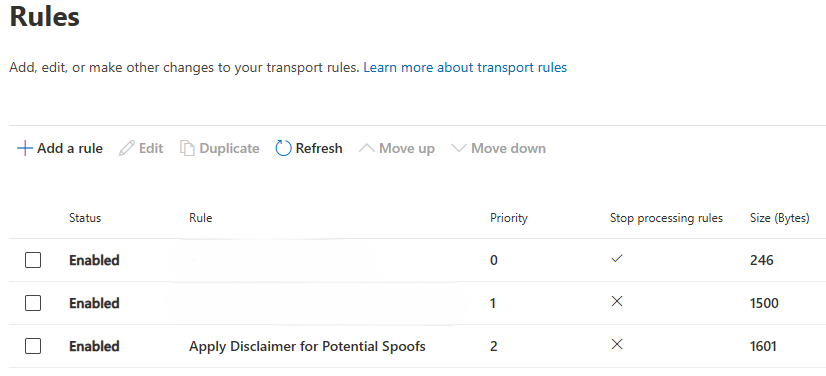
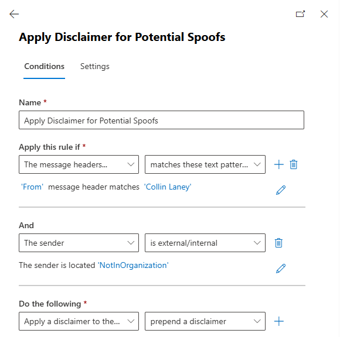

# Update-SpoofingDisclaimerRule.ps1

A PowerShell script that automatically updates Exchange Online mail flow rules with user display names and common name variations to help identify potential spoofing attempts.

## Table of Contents

-   [Overview](#overview)
-   [Features](#features)
-   [Requirements](#requirements)
-   [Installation](#installation)
-   [Usage](#usage)
-   [Configuration](#configuration)
-   [Screenshots](#screenshots)
-   [HTML Disclaimer Template](#html-disclaimer-template)
-   [Limitations](#limitations)
-   [Troubleshooting](#troubleshooting)

## Overview

This script addresses the growing concern of email spoofing by automatically maintaining a comprehensive list of user display names and their common variations in an Exchange Online transport rule. When someone attempts to spoof an internal user by using a nickname or variation of their name, the rule will trigger and apply a disclaimer warning recipients of the potential spoofing attempt.

### How It Works

1. **Connects** to Exchange Online using modern authentication
2. **Retrieves** all user display names from your organization
3. **Generates** common name variations (e.g., Mike ↔ Michael, Bob ↔ Robert)
4. **Updates** the specified transport rule with the complete list
5. **Provides** detailed logging and error handling

## Features

-   ✅ **Automatic Module Management**: Installs ExchangeOnlineManagement module if missing
-   ✅ **Comprehensive Name Database**: 200+ common name variations included
-   ✅ **Smart Connection Handling**: Detects existing Exchange Online sessions
-   ✅ **Flexible Configuration**: Customizable rule names and exclusion lists
-   ✅ **Robust Error Handling**: Detailed exit codes and logging
-   ✅ **Professional Template**: Follows PowerShell best practices
-   ✅ **Verbose Logging**: Detailed output for troubleshooting

## Requirements

### PowerShell Environment

-   **PowerShell Version**: 5.1 or higher
-   **Execution Policy**: RemoteSigned or Unrestricted
-   **Operating System**: Windows 10/11, Windows Server 2016+

### Permissions

-   **Exchange Online Administrator**: Required to manage transport rules
-   **Azure AD User Reader**: Needed to retrieve user display names
-   **PowerShell Module Installation**: Local admin rights may be required for module installation

### Dependencies

-   **ExchangeOnlineManagement Module**: Automatically installed by the script if missing
-   **Active Internet Connection**: Required for Exchange Online connectivity
-   **Modern Authentication**: MFA-enabled accounts supported

## Installation

### 1. Download the Script

```powershell
# Option 1: Clone the repository
git clone https://github.com/ColDog5044/PowerShell-Resources.git
cd PowerShell-Resources/Microsoft365/ExchangeOnline/MailFlowRules

# Option 2: Download directly
Invoke-WebRequest -Uri "https://raw.githubusercontent.com/ColDog5044/PowerShell-Resources/main/Microsoft365/ExchangeOnline/MailFlowRules/Update-SpoofingDisclaimerRule.ps1" -OutFile "Update-SpoofingDisclaimerRule.ps1"
```

### 2. Set Execution Policy (if needed)

```powershell
Set-ExecutionPolicy -ExecutionPolicy RemoteSigned -Scope CurrentUser
```

### 3. Create the Transport Rule

Before running the script, you'll need to create the transport rule in Exchange Online:

1. Go to **Exchange Admin Center** → **Mail Flow** → **Rules**
2. Click **"+ Add a rule"** → **"Apply disclaimers..."**
3. Configure the rule with these settings:
    - **Name**: `Apply Disclaimer for Potential Spoofs`
    - **Apply this rule if**: `The sender` → `header matches any of these text patterns` → `From` → `(will be populated by script)`
    - **Do the following**: `Apply the disclaimer` → `Append the disclaimer`
    - **Enter text**: Use the [HTML disclaimer template](#html-disclaimer-template) below

## Usage

### Basic Usage

```powershell
# Run with default settings
.\Update-SpoofingDisclaimerRule.ps1
```

### Advanced Usage

```powershell
# Specify a custom rule name
.\Update-SpoofingDisclaimerRule.ps1 -RuleName "Custom Spoofing Detection Rule"

# Run with verbose output
.\Update-SpoofingDisclaimerRule.ps1 -Verbose

# Run with specific rule name and verbose logging
.\Update-SpoofingDisclaimerRule.ps1 -RuleName "My Custom Rule" -Verbose
```

## Configuration

### Excluded Names

You can modify the excluded names list in the script by editing the `$excludeNames` array:

```powershell
# Define names to exclude from the spoofing rule
$excludeNames = @(
    "Mailbox",
    "DMARC",
    "Helpdesk",
    "NoReply",
    "DoNotReply",
    "System Administrator"
)
```

### Adding Custom Name Variations

To add custom name variations, modify the `Get-NameAlterations` function:

```powershell
function Get-NameAlterations {
    return @{
        # Existing variations...
        "CustomName"     = "CustomNickname"
        "CustomNickname" = "CustomName"
        # Add more as needed...
    }
}
```

## Screenshots

### Exchange Admin Center - Transport Rules



### Rule Condition Populated



## HTML Disclaimer Template

Use this HTML template for your disclaimer message:

```html
<div
	style="
		background-color: #fdf2f4;
		border: 1pt solid #f87171;
		border-left: 6pt solid #910a19;
		border-radius: 4pt;
		margin: 10pt 0;
		padding: 12pt;
		font-family: Verdana, sans-serif;
	"
>
	<div style="margin-bottom: 8pt; color: #910a19; font-weight: bold; font-size: 12pt">POTENTIAL SPOOFING</div>
	<div style="font-size: 10pt; color: #374151; line-height: 1.4; margin-bottom: 8pt">
		This external email appears to mimic someone from your organization. This could be a legitimate personal email, forwarded message,
		or a spoofing attempt.
	</div>
	<div style="background-color: #fee2e2; padding: 8pt; border-radius: 3pt; font-size: 9pt; color: #910a19">
		<strong>RECOMMENDED ACTIONS:</strong>
		<br />• Verify sender identity through known, trusted contact methods <br />• Be cautious with sensitive information requests or
		urgent actions <br />• Report to the IT Department if you are unsure
	</div>
</div>
```

<div
	style="
		background-color: #fdf2f4;
		border: 1pt solid #f87171;
		border-left: 6pt solid #910a19;
		border-radius: 4pt;
		margin: 10pt 0;
		padding: 12pt;
		font-family: Verdana, sans-serif;
	"
>
	<div style="margin-bottom: 8pt; color: #910a19; font-weight: bold; font-size: 12pt">POTENTIAL SPOOFING</div>
	<div style="font-size: 10pt; color: #374151; line-height: 1.4; margin-bottom: 8pt">
		This external email appears to mimic someone from your organization. This could be a legitimate personal email, forwarded message,
		or a spoofing attempt.
	</div>
	<div style="background-color: #fee2e2; padding: 8pt; border-radius: 3pt; font-size: 9pt; color: #910a19">
		<strong>RECOMMENDED ACTIONS:</strong>
		<br />• Verify sender identity through known, trusted contact methods <br />• Be cautious with sensitive information requests or
		urgent actions <br />• Report to the IT Department if you are unsure
	</div>
</div>

### Alternative Simple Disclaimer

```html
<div
	style="
		background-color: #fdf2f4;
		border-left: 4px solid #910a19;
		padding: 8pt;
		margin: 8pt 0;
		font-size: 10pt;
		font-family: Verdana, Geneva, Tahoma, sans-serif;
		line-height: 1.5;
	"
>
	<strong style="color: #910a19; font-size: 12pt; font-family: monospace">WARNING:</strong>
	<span style="color: #333333">
		This email appears to be from someone in your organization but was sent externally. Please verify the sender before responding to
		requests for sensitive information. Report to the IT Department if you are unsure.
	</span>
</div>
```

<div
	style="
		background-color: #fdf2f4;
		border-left: 4px solid #910a19;
		padding: 8pt;
		margin: 8pt 0;
		font-size: 10pt;
		font-family: Verdana, Geneva, Tahoma, sans-serif;
		line-height: 1.5;
	"
>
	<strong style="color: #910a19; font-size: 12pt; font-family: monospace">WARNING:</strong>
	<span style="color: #333333">
		This email appears to be from someone in your organization but was sent externally. Please verify the sender before responding to
		requests for sensitive information. Report to the IT Department if you are unsure.
	</span>
</div>

**Or even simpler (text-only for maximum capacity):**

```
⚠️ EXTERNAL EMAIL - This appears to be from your organization but was sent externally. Verify sender before responding to sensitive requests.
```

## Limitations

### Exchange Online Transport Rule Limits

-   **Total Rule Size Limit**: **8,196 bytes (8KB) for the entire rule** including conditions, actions, and disclaimers
-   **Pattern Count Impact**: Fewer name patterns available when using longer disclaimers
-   **Disclaimer Size Trade-off**: Shorter disclaimers = more name patterns possible
-   **Processing Impact**: Large rule sets may impact mail flow performance

### Script Limitations

-   **Name Matching**: Only matches exact name parts (case-sensitive)
-   **Unicode Support**: Limited to standard ASCII characters
-   **Pattern Complexity**: Simple string replacement only
-   **Update Frequency**: Manual execution required (unless scheduled)
-   **Size Calculation**: Script doesn't pre-validate total rule size before updating

### Workarounds for Large Organizations

If you exceed the 8,196-byte limit, consider these strategies:

1. **Minimize Disclaimer Size**: Use the simplest effective disclaimer to maximize name capacity
2. **Multiple Rules**: Split into multiple transport rules by department or priority
3. **Priority Users**: Focus on executives and high-value targets only
4. **Common Names Only**: Use only the most frequent name variations
5. **Regular Cleanup**: Remove variations for departed employees
6. **Text-Only Disclaimers**: Avoid HTML formatting to save bytes

### Disclaimer Size Guidelines

To maximize name pattern capacity:

-   **Optimal**: 50-100 character plain text disclaimer (~1,200+ names possible)
-   **Acceptable**: 200-300 character simple HTML disclaimer (~800+ names possible)
-   **Minimal**: Complex HTML with styling (~400+ names possible)

**Recommendation**: Start with a simple text disclaimer and expand only if needed.

## Troubleshooting

### Module Installation Fails

```powershell
# Error: Unable to install ExchangeOnlineManagement module
# Solution: Run PowerShell as Administrator
Start-Process PowerShell -Verb RunAs
Install-Module ExchangeOnlineManagement -Force -AllowClobber
```

### Authentication Fails

```powershell
# Error: Unable to connect to Exchange Online
# Solution: Check MFA settings and global admin permissions
Connect-ExchangeOnline -UserPrincipalName admin@yourdomain.com
```

### Rule Not Found

```powershell
# Error: Transport rule 'Apply Disclaimer for Potential Spoofs' not found
# Solution: Create the rule first or specify correct name
.\Update-SpoofingDisclaimerRule.ps1 -RuleName "Your Actual Rule Name"
```

### Too Many Patterns / Rule Size Exceeded

```powershell
# Error: Rule size exceeds maximum limit (8,196 bytes)
# Solutions:
# 1. Use a shorter disclaimer
# 2. Reduce the name variations list
# 3. Create multiple rules
# 4. Focus on high-priority users only

# Check current rule size (approximate)
Get-TransportRule "Apply Disclaimer for Potential Spoofs" | Select-Object Name, HeaderMatchesPatterns | ConvertTo-Json | Measure-Object -Character
```

## Debug Mode

Enable verbose output for troubleshooting:

```powershell
$VerbosePreference = "Continue"
.\Update-SpoofingDisclaimerRule.ps1 -Verbose
```

### Log Files

The script outputs to the console only. To capture logs:

```powershell
.\Update-SpoofingDisclaimerRule.ps1 *>&1 | Tee-Object -FilePath "spoofing-rule-update.log"
```

## Exit Codes

-   **0**: Success - Script completed successfully
-   **1**: Failure - General script execution failure
-   **2**: Script Error - Module installation failed or cleanup error

## Best Practices

### Maintenance

-   Run the script monthly to capture new employees
-   Review excluded names list quarterly
-   Update name variations based on organizational naming conventions
-   Test rule functionality with controlled emails
-   **Monitor rule size**: Regularly check total rule size to stay under 8,196-byte limit
-   **Optimize disclaimers**: Use shortest effective disclaimer to maximize name capacity
-   **Track performance**: Monitor mail flow performance impact of large rule sets

---

> [!Important]
> This script helps detect potential spoofing attempts but should be part of a comprehensive email security strategy including SPF, DKIM, DMARC, and user security awareness training.
