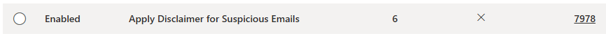
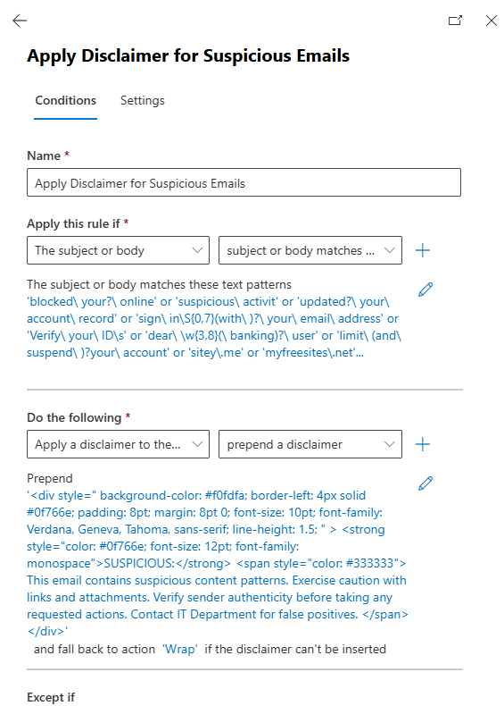

# Update-SuspiciousEmailDisclaimerRule.ps1

A PowerShell script that automatically updates Exchange Online mail flow rules with comprehensive regex patterns to detect suspicious emails and potential phishing attempts.

## Table of Contents

-   [Overview](#overview)
-   [Features](#features)
-   [Requirements](#requirements)
-   [Installation](#installation)
-   [Usage](#usage)
-   [Pattern Categories](#pattern-categories)
-   [Configuration](#configuration)
-   [Screenshots](#screenshots)
-   [Size Optimization](#size-optimization)
-   [Limitations](#limitations)
-   [Troubleshooting](#troubleshooting)

## Overview

This script addresses the growing threat of phishing and suspicious emails by automatically maintaining a comprehensive list of regex patterns in an Exchange Online transport rule. The patterns detect various indicators of malicious content including suspicious domains, phishing phrases, and common social engineering tactics.

### How It Works

1. **Connects** to Exchange Online using modern authentication
2. **Loads** 100 carefully curated suspicious email patterns
3. **Updates** the specified transport rule with pattern matching for subjects and message bodies
4. **Optimizes** for Exchange Online's 8KB rule size limit
5. **Provides** detailed logging and error handling

## Features

-   ✅ **Comprehensive Pattern Database**: 100+ suspicious email indicators
-   ✅ **Multi-Category Detection**: URLs, domains, phrases, and subject patterns
-   ✅ **Size Optimized**: Stays within Exchange Online 8KB limit (~7,978 bytes used)
-   ✅ **Automatic Module Management**: Installs ExchangeOnlineManagement module if missing
-   ✅ **Smart Connection Handling**: Detects existing Exchange Online sessions
-   ✅ **Flexible Configuration**: Customizable rule names
-   ✅ **Robust Error Handling**: Detailed exit codes and logging
-   ✅ **Professional Template**: Follows PowerShell best practices
-   ✅ **Verbose Logging**: Detailed output for troubleshooting

## Requirements

### PowerShell Environment

-   **PowerShell Version**: 5.1 or higher
-   **Execution Policy**: RemoteSigned or Unrestricted
-   **Operating System**: Windows 10/11, Windows Server 2016+

### Permissions

-   **Exchange Online Administrator**: Required to manage transport rules
-   **PowerShell Module Installation**: Local admin rights may be required for module installation

### Dependencies

-   **ExchangeOnlineManagement Module**: Automatically installed by the script if missing
-   **Active Internet Connection**: Required for Exchange Online connectivity
-   **Modern Authentication**: MFA-enabled accounts supported

## Installation

### 1. Download the Script

```powershell
# Option 1: Clone the repository
git clone https://github.com/ColDog5044/PowerShell-Resources.git
cd PowerShell-Resources/Microsoft365/ExchangeOnline/MailFlowRules/SuspiciousEmailDisclaimer

# Option 2: Download directly
Invoke-WebRequest -Uri "https://raw.githubusercontent.com/ColDog5044/PowerShell-Resources/main/Microsoft365/ExchangeOnline/MailFlowRules/SuspiciousEmailDisclaimer/Update-SuspiciousEmailDisclaimerRule.ps1" -OutFile "Update-SuspiciousEmailDisclaimerRule.ps1"
```

### 2. Set Execution Policy (if needed)

```powershell
Set-ExecutionPolicy -ExecutionPolicy RemoteSigned -Scope CurrentUser
```

### 3. Create the Transport Rule

Before running the script, you'll need to create the transport rule in Exchange Online:

1. Go to **Exchange Admin Center** → **Mail Flow** → **Rules**
2. Click **"+ Add a rule"** → **"Apply disclaimers..."**
3. Configure the rule with these settings:
    - **Name**: `Apply Disclaimer for Suspicious Emails`
    - **Apply this rule if**: `The subject or body` → `matches any of these text patterns` → `(will be populated by script)`
    - **Do the following**: `Apply the disclaimer` → `Append the disclaimer`
    - **Enter text**: Use the [HTML disclaimer template](#html-disclaimer-template) below

## Usage

### Basic Usage

```powershell
# Run with default settings
.\Update-SuspiciousEmailDisclaimerRule.ps1
```

### Advanced Usage

```powershell
# Specify a custom rule name
.\Update-SuspiciousEmailDisclaimerRule.ps1 -RuleName "Custom Suspicious Email Rule"

# Run with verbose output
.\Update-SuspiciousEmailDisclaimerRule.ps1 -Verbose

# Run with specific rule name and verbose logging
.\Update-SuspiciousEmailDisclaimerRule.ps1 -RuleName "My Phishing Detection Rule" -Verbose
```

## Pattern Categories

The script includes 100 carefully curated patterns across multiple categories:

### 1. Suspicious Domains & URLs (41 patterns)
- **Free hosting sites**: `.000webhost.com`, `.weebly.com`, `.wix.com`
- **URL shorteners**: `tiny.cc/`, `is.gd/`
- **Suspicious TLDs**: `.xyz/`, `.top/`, `.joburg`
- **Phishing domains**: `pyapal`, `icloud-`, `outlook\W365`

### 2. Suspicious Phrases (28 patterns)
- **Urgency tactics**: `has been compromised`, `your account will be closed`
- **Social engineering**: `urged to download`, `multiple login attempt`
- **Poor grammar**: `informations has been`, `fallow our process`
- **Action requests**: `activate your account`, `verify and reactivate`

### 3. Subject Line Indicators (15 patterns)
- **Account threats**: `has been limited`, `has been suspended`
- **Fake notifications**: `unusual activity`, `notifications pending`
- **Impersonation**: `new voice mail`, `wire transfer`

### 4. File & Path Patterns (16 patterns)
- **Fake services**: `/GoogleDrive/`, `/office365/`, `/helpdesk/`
- **Malicious files**: `\w\.jar`, `/uploadfile/`
- **Banking spoofs**: `/natwest/`, `/www/amazon`

## Configuration

### Customizing Patterns

You can modify the patterns by editing the `Get-SuspiciousPatterns` function:

```powershell
function Get-SuspiciousPatterns {
    return @(
        # Add your custom patterns here
        "your custom pattern",
        "another suspicious phrase",
        # Existing patterns...
    )
}
```

### Rule Name Customization

The default rule name is `"Apply Disclaimer for Suspicious Emails"`, but you can change it:

```powershell
# In the script parameters
param (
    [Parameter(Mandatory = $false)]
    [string]$RuleName = "Your Custom Rule Name"
)
```

## Size Optimization

The script is optimized for Exchange Online's 8KB transport rule limit:

- **Current usage**: ~7,978 bytes (97.4% of limit)
- **Remaining space**: 214 bytes
- **Pattern count**: 100 suspicious indicators
- **Optimized for**: Maximum detection with minimal size impact

## Screenshots

### Exchange Admin Center - Transport Rules



### Rule Condition Populated



## HTML Disclaimer Template

Use this HTML template for your disclaimer message:


### Disclaimer for Suspicious Emails

```html
<div
	style="
		background-color: #f0fdfa;
		border: 1pt solid #14b8a6;
		border-left: 6pt solid #0f766e;
		border-radius: 4pt;
		margin: 10pt 0;
		padding: 12pt;
		font-family: Verdana, sans-serif;
	"
>
	<div style="margin-bottom: 8pt; color: #0f766e; font-weight: bold; font-size: 12pt">SUSPICIOUS EMAIL</div>
	<div style="font-size: 10pt; color: #374151; line-height: 1.4; margin-bottom: 8pt">
		This email has been flagged for containing potentially suspicious patterns, including phishing keywords, urgent language, or
		questionable attachments.
	</div>
	<div style="background-color: #ccfbf1; padding: 8pt; border-radius: 3pt; font-size: 9pt; color: #0f766e">
		<strong>RECOMMENDED ACTIONS:</strong>
		<br />• Do not click links or download attachments without verification <br />• Independently verify sender identity through known
		contact methods <br />• Report to the IT Department if you believe this is a legitimate email
	</div>
</div>
```

<div
	style="
		background-color: #f0fdfa;
		border: 1pt solid #14b8a6;
		border-left: 6pt solid #0f766e;
		border-radius: 4pt;
		margin: 10pt 0;
		padding: 12pt;
		font-family: Verdana, sans-serif;
	"
>
	<div style="margin-bottom: 8pt; color: #0f766e; font-weight: bold; font-size: 12pt">SUSPICIOUS EMAIL</div>
	<div style="font-size: 10pt; color: #374151; line-height: 1.4; margin-bottom: 8pt">
		This email has been flagged for containing potentially suspicious patterns, including phishing keywords, urgent language, or
		questionable attachments.
	</div>
	<div style="background-color: #ccfbf1; padding: 8pt; border-radius: 3pt; font-size: 9pt; color: #0f766e">
		<strong>RECOMMENDED ACTIONS:</strong>
		<br />• Do not click links or download attachments without verification <br />• Independently verify sender identity through known
		contact methods <br />• Report to the IT Department if you believe this is a legitimate email
	</div>
</div>

### Alternative Simple Disclaimer

```html
<div
	style="
		background-color: #f0fdfa;
		border-left: 4px solid #0f766e;
		padding: 8pt;
		margin: 8pt 0;
		font-size: 10pt;
		font-family: Verdana, Geneva, Tahoma, sans-serif;
		line-height: 1.5;
	"
>
	<strong style="color: #0f766e; font-size: 12pt; font-family: monospace">SUSPICIOUS:</strong>
	<span style="color: #333333">
		This email contains suspicious content patterns. Exercise caution with links and attachments. Verify sender authenticity before
		taking any requested actions. Report to the IT Department if you believe this is a legitimate email.
	</span>
</div>
```

<div
	style="
		background-color: #f0fdfa;
		border-left: 4px solid #0f766e;
		padding: 8pt;
		margin: 8pt 0;
		font-size: 10pt;
		font-family: Verdana, Geneva, Tahoma, sans-serif;
		line-height: 1.5;
	"
>
	<strong style="color: #0f766e; font-size: 12pt; font-family: monospace">SUSPICIOUS:</strong>
	<span style="color: #333333">
		This email contains suspicious content patterns. Exercise caution with links and attachments. Verify sender authenticity before
		taking any requested actions. Report to the IT Department if you believe this is a legitimate email.
	</span>
</div>

## Limitations

### Exchange Online Transport Rule Limits

-   **Maximum Rule Size**: 8,192 bytes (8KB) total rule configuration
-   **Current Usage**: ~7,978 bytes (97.4% of limit) with 100 patterns
-   **Pattern Limit**: No specific limit, but constrained by total rule size
-   **Regex Complexity**: Some complex patterns may impact performance

### Script Limitations

-   **Static Pattern List**: Patterns are hardcoded in the script
-   **Single Rule Update**: Updates one rule at a time
-   **No Pattern Validation**: Doesn't validate regex syntax before applying
-   **Size Calculation**: Script doesn't pre-validate total rule size before updating

### Performance Considerations

-   **Regex Performance**: Complex patterns may slow email processing
-   **False Positives**: Some patterns may match legitimate emails
-   **Update Frequency**: Frequent updates may cause brief mail flow delays

## Troubleshooting

### Module Installation Fails

```powershell
# Error: Unable to install ExchangeOnlineManagement module
# Solution: Run PowerShell as Administrator
Start-Process PowerShell -Verb RunAs
Install-Module ExchangeOnlineManagement -Force -AllowClobber
```

### Authentication Fails

```powershell
# Error: Unable to connect to Exchange Online
# Solution: Check MFA settings and global admin permissions
Connect-ExchangeOnline -UserPrincipalName admin@yourdomain.com
```

### Rule Not Found

```powershell
# Error: Transport rule 'Apply Disclaimer for Suspicious Emails' not found
# Solution: Create the rule first or specify correct name
.\Update-SuspiciousEmailDisclaimerRule.ps1 -RuleName "Your Actual Rule Name"
```

### Rule Size Exceeded

```powershell
# Error: The rule can't be created because it is too large
# Solution: Reduce pattern count or optimize disclaimer size
# Current script is optimized to ~7,978 bytes (214 bytes remaining)
```

### False Positives

If legitimate emails are being flagged:

1. **Review Triggered Patterns**: Check which patterns are matching
2. **Refine Regex**: Make patterns more specific
3. **Add Exceptions**: Use Exchange rule exceptions for known senders
4. **Test Patterns**: Validate against known good emails

### Pattern Updates

To add new suspicious patterns:

1. **Check Remaining Space**: Current usage is ~7,978/8,192 bytes
2. **Test Pattern**: Validate regex syntax
3. **Update Function**: Add to `Get-SuspiciousPatterns`
4. **Monitor Size**: Ensure you don't exceed 8KB limit

## Exit Codes

The script uses standard exit codes for automation and monitoring:

-   **0**: Success - Rule updated successfully
-   **1**: Failure - General script execution error
-   **2**: Script Error - Module installation or connection failure

## Credits and Attribution

-   **Pattern Source**: Suspicious email patterns adapted from [SwiftOnSecurity's PhishingRegex](https://github.com/SwiftOnSecurity/PhishingRegex)
-   **Script Author**: Collin Laney
-   **Version**: 1.0 (2025-08-08)

## Support and Contributing

For issues, suggestions, or contributions:

1. **Report Issues**: Open an issue on GitHub
2. **Suggest Patterns**: Submit pull requests with new suspicious patterns
3. **Documentation**: Help improve the README and documentation
4. **Testing**: Test the script in different environments

---

> [!IMPORTANT]
> **⚠️ Important Security Note**: This script helps detect suspicious emails but should be part of a comprehensive email security strategy. It is not a replacement for dedicated email security solutions, user training, or proper security policies.
